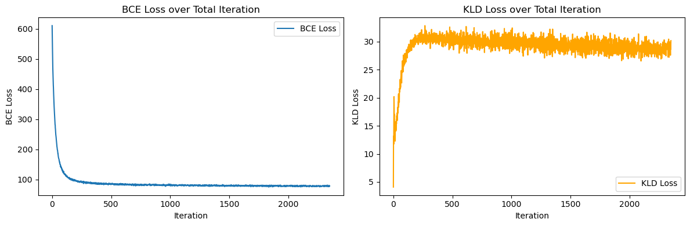
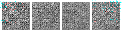
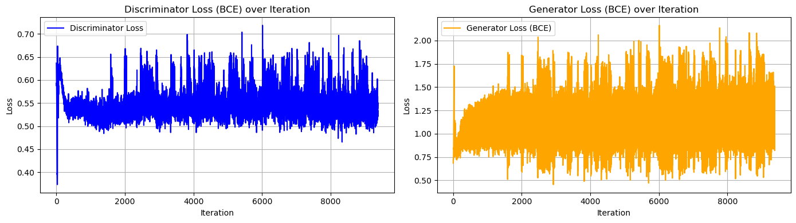
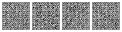

# VAE & GAN Practice with MNIST

MNIST 데이터셋을 활용한 VAE(Variational Autoencoder)와 GAN(Generative Adversarial Network) 구현 및 학습 실습

## 프로젝트 구조

```
.
├── CV_22_week4.ipynb      # 메인 학습 노트북
├── vae_gen_imgs/          # VAE 생성 이미지
├── vae_recon_imgs/        # VAE 재구성 이미지
├── gan_gen_imgs/          # GAN 생성 이미지
├── VAE_output.png         # VAE 학습 곡선 그래프
├── GAN_output.png         # GAN 학습 곡선 그래프
└── README.md              # 프로젝트 설명 문서
```

## 모델 구성

### VAE (Variational Autoencoder)
- **Encoder**: Conv2d layers (1→16→8) + FC layers
- **Decoder**: FC layer + ConvTranspose2d layers (8→16→1)
- **Latent dimension**: 32
- **Loss**: BCE + KL Divergence

### GAN (Generative Adversarial Network)
- **Generator**: ConvTranspose2d layers (100→128→64→1)
- **Discriminator**: Conv2d layers (1→64→128→1)
- **Loss**: BCEWithLogitsLoss with label smoothing

## 실험 결과

### VAE 성능

#### 학습 곡선

*BCE Loss와 KLD Loss의 학습 진행 과정*

#### 생성 결과 (학습 진행 과정)
| Step 0 | Step 500 | Step 1000 | Step 2300 |
|--------|----------|-----------|-----------|
|  |  |  |  |
| 초기 노이즈 | 형태 형성 중 | 숫자 생성 시작 | 최종 결과 |

*Latent space에서 랜덤 샘플링하여 생성한 숫자 이미지*

#### 재구성 결과


*원본 이미지(상단)와 재구성된 이미지(하단) 비교 (Step 2300)*

- 빠른 수렴 (1000 스텝 이내)
- 안정적인 학습 곡선
- 우수한 재구성 능력
- 생성 이미지: 약간 흐리지만 명확한 숫자 형태

### GAN 성능

#### 학습 곡선

*Discriminator와 Generator의 Loss 변화 추이*

#### 생성 결과 (학습 진행 과정)
| Step 0 | Step 2000 | Step 5000 | Step 9300 |
|--------|-----------|-----------|-----------|
|  |  |  |  |
| 초기 노이즈 | 패턴 형성 중 | 숫자 생성 성공 | 최종 결과 |

*Generator가 노이즈에서 숫자를 생성하는 과정*

- 안정화 기법 적용 후 성공적 학습
- 5000 스텝 이후 명확한 숫자 생성
- 더 선명한 이미지 품질
- Label smoothing과 gradient clipping으로 mode collapse 방지

## 학습 환경
- MPS/CUDA 지원
- MNIST 데이터셋

## 주요 개선 사항
- MPS 디바이스 지원 추가
- GAN 안정화: Label smoothing, Gradient clipping, 학습률 조정
- Generator 업데이트 빈도 증가 (2회)